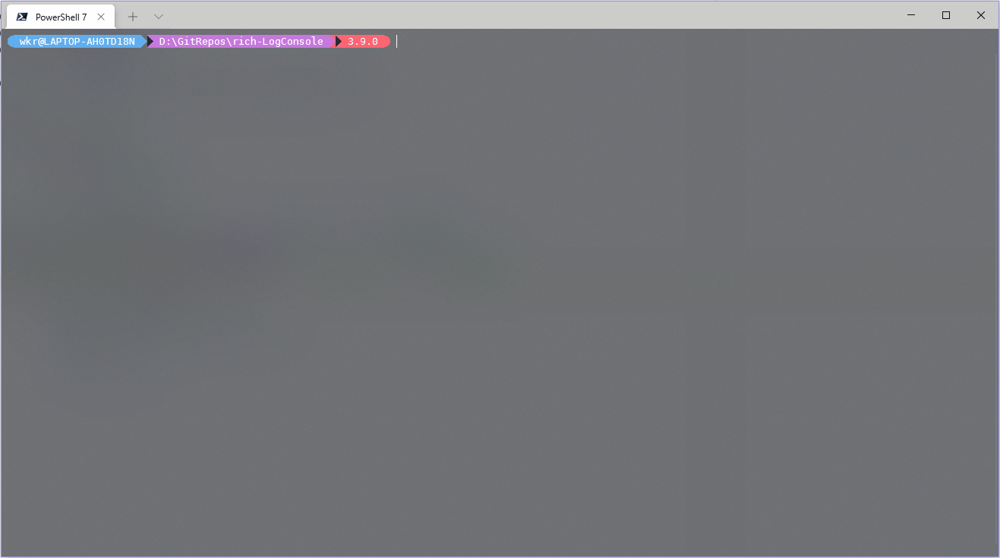

# rich-LogConsole
一个实现了在一定高度自动滚动的`rich`日志组件，有两种刷新方式，建议配合Layout、Panel等组件使用。

## install
```shell
pip install rich-LogConsole
```

## use
```python
from rich_LogConsole import LogConsoleScroll, LogConsoleOverwrite
```

## demo
见[demo.py](tests/demo.py)


## License
[GPLv3](LICENSE)